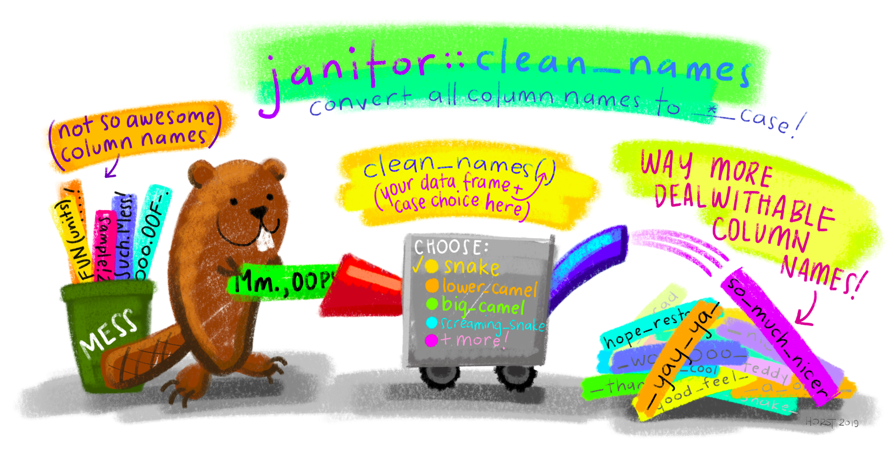
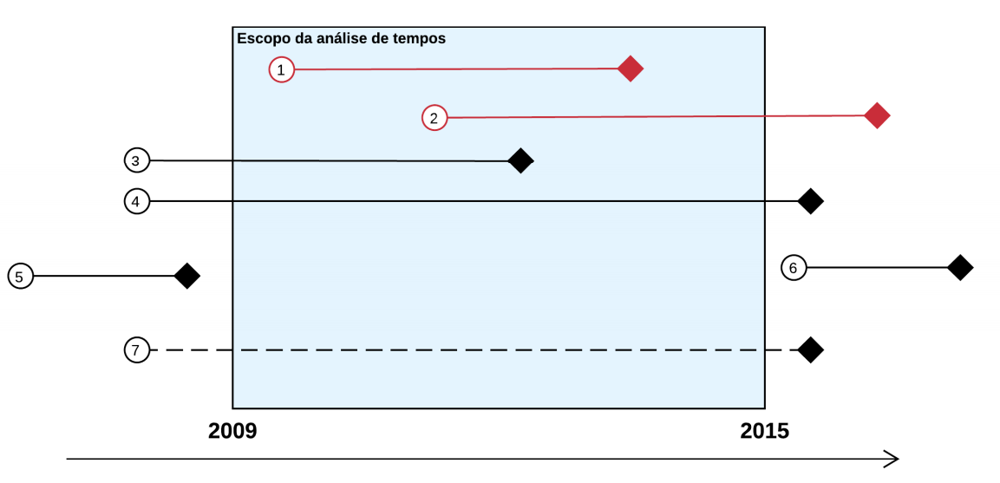

```{r setup, include=FALSE}
knitr::opts_chunk$set(
  echo = FALSE,
  message = FALSE,
  warning = FALSE,
  fig.align = "center"
)

blue <- function(x) {
  glue::glue(
    '<span style="color:#6495ed; font-weight: bold;">{x}</span>'
  ) |> 
    htmltools::HTML()
}
```


## O que estamos fazendo aqui?

Neste semestre, tentaremos responder à pergunta: 

<center> <b>Como desenvolver um projeto de jurimetria?</b> </center>

--

Nossa jornada começa com as definições básicas de jurimetria e, através de diversos exemplos, discutiremos todos os aspectos metodológicos envolvidos.

--

No final, você será capaz de 

- pensar um problema cientificamente, 
- construir boas perguntas de pesquisa, 
- planejar um estudo jurimétrico e 
- desenhar o passo-a-passo para realizá-lo na prática. 

--

Se quiser, você poderá até realizar algumas análises e programas!

---

## VAMOS APRENDER IA??!?!!11

--

- Sim, mas provavelmente não da forma que você espera 😉 

--

- Tem muito *hype* em torno da Inteligência Artificial.

```{r}
knitr::include_graphics("img/toad-hype-hype.gif")
```

--

- Vamos discutir o tema a partir de aplicações.

---

## As aulas

- As aulas acontecerão às sextas, das 10h15 às 11h55.

--

Uso do tempo de aula (aproximado)

```{r, echo=FALSE}
tab <- tibble::tribble(
  ~Horario, ~Atividade,
  "10h15 - 10h30", "Dúvidas e correção do quiz da aula anterior",
  "10h30 - 11h30", "Aula expositiva",
  "11h30 - 11h55", "Dúvidas e quiz"
)
knitr::kable(tab)
```

---
class: middle

## Dinâmica das aulas

- Pode me interromper para dúvidas e comentários. O plano de aula é apenas um guia, mas a aula vai para onde a gente quiser.

--

- Algumas dúvidas serão respondidas na hora. Outras serão respondidas mais tarde na própria aula ou em aulas futuras.

---
class: middle

## Materiais

- Os slides, quizzes etc serão disponibilizados na [página do curso](https://ndtj.github.io/202203-m-jurimetria).

- Outros materiais poderão ser disponibilizados no __Teams__.

- Perguntas podem ser enviadas pelo Teams ou no e-mail [jaztrecenti@pucsp.br](mailto:jaztrecenti@pucsp.br)

---

## Por onde vamos?

Jurimetria não é software, é processo. Vamos aprender como isso funciona e o que devemos levar em conta.

<center>

</center>   

---
class: center, middle, inverse

# Plano de aulas

```{r, echo=FALSE, message=FALSE, results='asis'}

googlesheets4::gs4_auth("julio.trecenti@gmail.com")
da <- googlesheets4::read_sheet("1aRaPjKO0h3F0S5pdXXT7rAnC66WVC52Mi08cHYlW3xY")

slide_aula <- function(x, y) {
  cat("\n---\n")
  cat(glue::glue("## {y}. {x$titulo}\n\n"))
  cat(glue::glue("__Data__: {format(as.Date(x$data), '%d/%m/%Y')}\n\n"))
  cat(glue::glue("\n\n__Tipo__: {x$tipo}\n\n"))
  cat(glue::glue("\n\n__Bimestre__: {x$bimestre}\n\n"))
  cat(glue::glue("\n\n__Atividades__:\n\n{x$tema}\n\n"))
  if (!is.na(x$obs)) cat(glue::glue("\n\n__Obs__: {x$obs}\n\n"))
}

da |> 
  dplyr::group_split(aula) |> 
  purrr::iwalk(slide_aula)

```

---

## Notas

Para cada bimestre:

- __Quiz do final da aula__: 50% 
    - Cada quiz vale 1,0 na nota do bimestre.
    - Cada quiz terá ~5 questões de múltipla escolha.
    - Poderemos ter questões extras, valendo __pontos extras__.
    - Os quizes podem ser feitos individualmente ou em grupo, mas a entrega é individual.
    - O prazo de cada quiz é de 1 semana: 23h59 da quinta-feira anterior à aula.
    
- __Prova__: 50%
    - Cada prova vale 5,0 na nota do bimestre
    - A prova poderá ter questões extras, valendo pontos extras. 
    - Dependendo do andar das aulas, poderemos substituir alguma prova por um trabalho em grupo.

---
class: middle

# Guia para os slides

#### Slides sobre cases: __<span style="color:#3B0F70;">marca azul</span>__

#### Slides sobre conceitos: __<span style="color:#DE4968;">marca rosa</span>__

#### Slides sobre metodologia: __<span style="color:#7AD151;">marca verde</span>__


---
class: center, middle, inverse

# Aspectos gerais da pesquisa jurimétrica

---
class: stats

# O que é jurimetria?

- Jurimetria é a __estatística__ aplicada ao __direito__.

--

- Fazer jurimetria é pensar o direito de forma __concreta__, colocando nosso objeto de estudo no __tempo__ e no __espaço__.

--

.pull-left[

### Estudo clássico

Princípios jurídicos e pensamento de especialistas sobre o valor de indenização por dano moral a ser concedido no contexto de direito do consumidor.

]

--

.pull-right[

### Estudo jurimétrico

Valores típicos de dano moral em sentenças de primeira instância de processos envolvendo direito do consumidor no Tribunal de Justiça de São Paulo em 2021.

]

--

A jurimetria __complementa__ o estudo clássico do direito, considerando leis, __princípios__ jurídicos e pensamentos abstratos como __hipóteses__ que se manifestam ou não na __realidade__ através das __decisões__ judiciais.


---
class: stats

# Definição de hipóteses


---
class: stats

# Definição de hipóteses


---
class: stats, middle, inverse, center

# Exemplo (em sala)

---
class: stats

# Ciclo da ciência de dados

Sabemos onde estão os dados. O que fazer?

```{r, out.width="90%"}
knitr::include_graphics("img/ciclo-ciencia-de-dados.png")
```

---
class: jurimetrics

# Nosso dia-a-dia

.pull-left[

#### Download

```{r, out.width="100%"}
knitr::include_graphics("img/download_esaj.png")
```

]

--

.pull-right[

#### Arrumação

```{r, out.width="100%"}
knitr::include_graphics("img/tidy_esaj.png")
```

]

--

.center[

#### Visualização / Modelagem

]

```{r, out.width="50%"}
knitr::include_graphics("img/model_esaj.png")
```

---
class: jurimetrics

## Resumo

__Conceitos__

- Pensar jurimetria é pensar de forma __concreta__
- A jurimetria é complementar ao estudo clássico do direito, e tem limites
- Para fazer jurimetria, precisamos de dados!

--

__Metodologia__

- Antes de realizar a coleta, precisamos definir nossas perguntas de pesquisa. Entender a teoria é muito importante!
- Os parâmetros da coleta precisam ser bem especificados.
- Algumas perguntas podem surgir durante a análise dos dados.

--

__Next__: Estatística básica 🤓 

---
class: middle, center, inverse

# Estatística básica

---
class: jurimetrics

# O que é estatística?

- Conjunto de ferramentas e técnicas para tratar dados.

- Fazemos estatísticas para extrair informações sumarizadas de dados.

- Também pode ser pensada como a *metaciência*, ou seja, ela organiza a forma que a ciência funciona.

---
class: jurimetrics

# Para que serve estatística?

- Usamos estatística para fazer afirmações sobre o desconhecido.

- Detectamos *tendências* para fazer previsões.

- Organizamos processos complexos de decisão.

- Aprendemos a controlar a incerteza que existe no mundo.

---

# Perguntas respondidas com estatística

- __Advogando__: quanto cobrar por esse processo?
- __No tribunal__: o estoque de processos está caindo?
- __Na minha empresa__: vale a pena fazer acordo?
- __No legislativo__: essa lei aumentou a litigiosidade?

---

# Perguntas não respondidas com estatística*

- __Advogando__: qual tese aplicar nesse caso?
- __No tribunal__: quais temas do direito devem ser especializados?
- __Na minha empresa__: como prevenir novos conflitos?
- __No legislativo__: essa lei é justa?

--

__Obs__: essas perguntas podem ser respondidas com estatística a partir de algumas suposições.

---
class: stats

# O que é um modelo estatístico?

- É uma redução da realidade a partir de uma fórmula matemática.

- Em outras palavras, é a formalização de uma teoria.

- A fórmula é uma representação do *mecanismo de geração dos dados*.

## Exemplos:

- Leis da física (gravidade, por exemplo)

- Distribuição das alturas da turma

---
class: stats

# O que é um modelo estatístico?

- Fórmulas matemáticas sempre apresentam erros

- A estatística assume que esses erros existem e colocam isso nas fórmulas, usando *distribuições de probabilidades*

- Por isso, aprender estatística envolve também aprender sobre teoria de probabilidades

---
class: middle, center, inverse, stats

# Medidas de posição

---
class: stats

# Média

- É a soma dos valores dividida pela quantidade de valores

- Está presente em tudo: desde as notas da faculdade até as redes neurais

---
class: stats

# Mediana

- São úteis quando temos dados assimétricos

- [Exemplo da Oprah](https://forum.abj.org.br/t/diferenca-entre-media-e-mediana/84/2)

```{r, out.width="40%"}

```

---
class: stats

# Limitações

- Conjuntos de dados muito diferentes levam a estatísticas de posição iguais.

- Exemplo das notas

---
class: middle, center, inverse, stats

# Medidas de variabilidade

---
class: stats

# Variância e desvio padrão

- __Variância__: É a soma dos valores em relação à média (ao quadrado), dividida pela quantidade de observações

- __Desvio padrão__: É a raiz quadrada da variância. A vantagem do desvio padrão é que está na mesma escala dos dados. Por exemplo, se temos uma variável em reais, o desvio padrão está em reais.

---
class: center, middle, inverse, stats

# Programação

---
class: stats

# Conteúdo

<center>

</center>   

---
class: stats

## Introdução ao R

.pull-left[
<br>
- R e RStudio

- Trabalhando com projetos

- Objetos e funções

- Pacotes
]

.pull-right[
<center>

<a href = "https://github.com/allisonhorst/stats-illustrations" target = "blank_">  </a>
</center>
]

---
class: stats

## Importação

.pull-left[
<br>
- Arquivos de texto

- Arquivos do excel

- Arquivos de outros softwares (SAS, SPSS)

- Conexão com banco de dados
]

.pull-right[
<br>
<center>

<a href = "https://github.com/allisonhorst/stats-illustrations" target = "blank_">  </a>
</center>
]

---
class: stats

## Transformação

.pull-left[
<br>        
- Selecionar colunas

- Filtrar linhas

- Criar ou modificar colunas

- Agrupar e sumarizar

- Juntar tabelas
]

.pull-right[
<center>

<a href = "https://github.com/allisonhorst/stats-illustrations" target = "blank_">  </a>
</center>
]

---
class: stats

## Visualização

<center>

<a href = "https://github.com/allisonhorst/stats-illustrations" target = "blank_">  </a>
</center>

---
class: stats

## Comunicação

- Relatórios automatizados
- Dashboards estáticos

<center>

<a href = "https://github.com/allisonhorst/stats-illustrations" target = "blank_">  </a>
</center>

---
class: stats

## Referência

<br>
<center>
<a href = "https://r4ds.had.co.nz">
 
</a>
</center>

---
class: middle, center, stats

# As vantagens de analisar dados usando linguagens de programação

---
class: middle, center, stats

### As principais linguagens para ciência de dados são
# Código Aberto

---
class: stats

# O que significa ser código aberto?

<br>

1. Acesso gratuito.

2. Estudantes podem usar as mesmas ferramentas que os profissionais.

3. Possibilita a existência de uma comunidade ativa.

4. Você pode corrigir problemas e aprimorar a linguagem.

5. Você pode desenvovler suas próprias ferramentas.

---
class: middle, center, stats
# O código é texto

---
class: stats

# Podemos copiar e colar

<br>
<center>

</center>

---
class: stats

# Reprodutibilidade

```{r, out.width="100%", echo=FALSE}
knitr::include_graphics("https://github.com/allisonhorst/stats-illustrations/raw/master/rstats-artwork/reproducibility_court.png")
```

---
class: middle, center, stats
# O código é uma linguagem

---
class: stats

# Podemos documentar a nossa análise

```{r message=FALSE, warning=FALSE, include=FALSE}
library(magrittr)
library(magick)
library(ggplot2)
library(dplyr)
library(viridis)
```

```{r frink, eval = FALSE, echo=TRUE}
image_read("https://jeroen.github.io/images/frink.png") |>
  image_rotate(270) |>
  image_background("blue", flatten = TRUE) |>
  image_border("red", "10x10") |>
  image_annotate("Linguagens de programação ainda\nsão linguagens!",
                 color = "white", size = 30)
```

--

.pull-left[
#### Entrada

]

--

.pull-right[
#### Saída
```{r frink-out, ref.label="frink", echo=FALSE}

```

]

---
class: middle, center, stats

# A relevância do R

---
class: stats

## O ciclo da ciência de dados


---
class: stats

## O ciclo da ciência de dados com o R


---
class: middle, center, stats

# Sugestões

---
class: stats

# Pratique

### O objetivo de hoje é ajudar a quebrar inércia da etapa inicial de aprendizado. Assim como um idioma, o único jeito de aprender uma linguagem de programação é praticando.


---
class: stats

# Pedindo ajuda

.pull-left[
<br>

- Documentação do R
- [Discourse Curso-r](https://discourse.curso-r.com)
- Google
- Stack Overflow
]

.pull-right[

]

---
class: stats

# Regras, boas práticas e estilo

<br>

Na grande maioria das vezes, você poderá resolver uma tarefa de diversas maneiras. Isso porque, apesar de existirem várias **regras**, linguagens de programação também possuem **boas práticas** e **estilos**.

- __Regras__: devem ser seguidas para o código funcionar (sintaxe, vocabulário)

- __Boas práticas__: recomenda-se seguir para a criação de códigos legíveis (espaçamento, nomes, organização)

- __Estilo__: cada um pode escolher aquele com o qual se sentir mais à vontade (tipos de indentação, formatação)

---
class: middle, center, inverse

# Pesquisa jurimétrica usando dados de jurisprudência

(estudos retrospectivos)

---
class: jurimetrics

# Objetivos de aprendizagem

- Entender sobre estudos prospectivos e retrospectivos

- Entender quando realizar uma análise de jurisprudência

- Fazer uma análise de jurisprudência live coding

---
class: stats

# Fontes de dados

- __Diários de Justiça__: PDFs gigantescos contendo toda a movimentação judiciária. Não é fácil lista processos a partir desses arquivos. É útil para estudos prospectivos.

--

- __Consulta de jurisprudência__: Ferramentas de pesquisa dos tribunais. É mais fácil de consultar, mas ficamos reféns da qualidade da ferramenta de pesquisa.

--

- __DataJud__: No futuro, teremos uma base de dados acessível e completa disponibilizada pelo CNJ (Resolução 331/2020). 

---
class: stats

# Estudos prospectivos e retrospectivos

- Estudos __prospectivos__ acompanham processos desde seu __nascimento__, identificado pela data de distribuição, até sua morte, identificada pela sentença, trânsito em julgado, arquivamento, etc. 
  
  - Importante em análise de tempos.
  - Análise de sobrevivência.

--

- Já estudos __retrospectivos__ são aqueles que indexam os processos por alguma data de __desfecho__, como uma sentença, um acórdão ou a data de arquivamento. 
  
  - Importante para análise de decisões.
  - Modelos preditivos.

---
class: stats

# Estudo prospectivo e retrospectivo

```{r}

```

---
class: stats

# Estrutura de dados

- __Capa__: contém classe, assunto, vara, comarca, status, indicador de processo digital, local físico, entre outras. 

- __Partes__: contém nomes dos autores e dos réus, advogado e tipo de participação.  

- __Movimentações__: contém datas, títulos e conteúdo de todas as movimentações públicas do processo. São movimentações desde despachos simples, remessas e conclusos até ata de audiências e sentenças completas.

- __Pasta digital__: contém todos os autos do processo, incluindo petição inicial, contestação e outros documentos não publicáveis. Os documentos só estão disponíveis em processos digitais, com acesso somente a advogados e pesquisadores credenciados.

---
class: jurimetrics

# Tempos em estudos retrospectivos

```{r}
xaringanExtra::use_panelset()
```

.panelset[

.panel[.panel-name[O que observamos]

```{r, fig.width=7, fig.height=3.4, dpi=300}
set.seed(1)
N <- 400
tabela <- tibble::tibble(
  data_entrada = runif(N, 2010, 2021.5),
  data_saida = data_entrada + rexp(N, 1/5),
  tempo = data_saida - data_entrada
) |> 
  dplyr::mutate(observado = dplyr::if_else(
    data_saida <= 2021.5, "Observado", "Não observado"
  ))

tabela |> 
  dplyr::filter(observado == "Observado") |> 
  ggplot2::ggplot(ggplot2::aes(data_entrada, tempo)) +
  ggplot2::geom_point(
    colour = viridis::viridis(1, 1, .2, .8, 1, "A")
  ) +
  ggplot2::geom_abline(
    slope = -1,
    intercept = 2021.5,
    colour = 2, 
    linetype = 2
  ) +
  ggplot2::scale_x_continuous(breaks = 2010:2021) +
  ggplot2::theme_minimal(12) +
  ggplot2::ylim(c(0,10)) +
  ggplot2::labs(x = "Ano entrada", y = "Tempo (anos)")
```

]

.panel[.panel-name[O que é de verdade]

```{r, fig.width=7, fig.height=3.95, dpi=300}
tabela |> 
  ggplot2::ggplot() +
  ggplot2::aes(data_entrada, tempo, colour = observado,
               alpha = observado) +
  ggplot2::geom_point() +
  ggplot2::geom_abline(
    slope = -1,
    intercept = 2021.5,
    colour = 2, 
    linetype = 2
  ) +
  ggplot2::scale_x_continuous(breaks = 2010:2021) +
  ggplot2::theme_minimal(12) +
  ggplot2::labs(
    x = "Ano entrada", y = "Tempo (anos)", 
    colour = "", alpha = ""
  ) +
  ggplot2::scale_colour_viridis_d(
    option = "A", begin = .2, end = .8, direction = -1
  ) +
  ggplot2::ylim(c(0,10)) +
  ggplot2::scale_alpha_discrete(range = c(.4, 1)) +
  ggplot2::theme(legend.position = "bottom")
```

]


]


```{r eval=FALSE}
set.seed(2)
s <- sample(tjsp2inst::tjsp2inst$info_valor, 5)
cat(scales::dollar(
  s, 
  prefix = "R$ ", big.mark = ".", decimal.mark = ",", accuracy = 0.01
), sep = ", ")

cat(scales::dollar(
  c(mean(s), median(s), var(s), sd(s)),
  prefix = "R$ ", big.mark = ".", decimal.mark = ",", accuracy = 0.01
), sep = "  | ")


```


---
class: stats

# Análise de tempos

- Quando o estudo é prospectivo, utilizamos uma técnica chamada __análise de sobrevivência__.

- A técnica é capaz de lidar corretamente com casos que ainda estão ativos no momento da análise. Denominamos esses casos como __censura__.

- A censura é capaz de lidar com informações incompletas. No nosso caso, sabemos que um processo ativo nascido em janeiro de 2021 durou __pelo menos 7 meses__ até agora.

---
class: case

# Exemplo!

```{r}
knitr::include_graphics("img/cat.gif")
```

---
class: center, middle, inverse

# Classificação Manual 

---

# Objetivos de aprendizagem de hoje

#### Conhecer os observatórios da ABJ

#### Compreender sobre classificação manual de processos

#### Compreender sobre análise de inconsistências

---
class: case

# Introdução

- Os observatórios da ABJ são estudos que analisam e monitoram processos complexos utilizando jurimetria.

- O objetivo principal dos projetos é esclarecer assuntos complexos e relevantes do Direito, com o intuito de formular melhores políticas públicas.

- Todos os relatórios dos observatórios são disponibilizados publicamente.

---
class: case

# Metodologia

1. Formulação de hipóteses, questões norteadoras e plano de execução.

1. Listagem de processos e obtenção da população de casos a serem analisados.

1. Elaboração e validação do questionário, através de aplicação de pré-teste.

1. Coleta e organização dos dados.

1. Análise dos dados obtidos e elaboração do relatório de análise.


---
class: jurimetrics

# Fluxo de trabalho

- Geralmente, os Observatórios são iniciados a partir da identificação de um tema interessante de análise. 

- Em seguida, especialistas no tema formulam hipóteses que levam às questões norteadoras da pesquisa. 

- Essas questões são organizadas em um documento contendo o plano de execução, que é passado para instituições apoiadoras em busca de recursos. 

- Após o levantamento dos recursos necessários, damos início ao cronograma de execução do projeto.

---
class: case

# Insolvência - Recuperações judiciais

```{r, out.width="80%"}
knitr::include_graphics("https://abj.org.br/img/cases/obsfase2.png")
```

---
class: case

# Insolvência - Falências

```{r}
knitr::include_graphics("https://abjur.github.io/obsFase3/relatorio/obs_fase3_abj_files/figure-html/razao-dist-1.svg")
```

---
class: case

# Mercado de Capitais

```{r, out.width="80%"}
knitr::include_graphics("https://abj.org.br/img/cases/cvm.png")
```

---
class: stats

# Automação

- Leitura, filtros, seleções

- Detecção das inconsistências

- Construção da base de dados arrumada

---
class: stats

# O que é faxina?

**Faxina de dados** é o processo de modificar uma ou mais tabelas até que elas atendam o princípio **tidy**, proposto por Hadley Wickham em um artigo de 2014.

Cada base exigirá uma **Faxina** diferente, pois não existe um único tipo de bagunça:

_Tidy data ~~Happy families~~ are all alike; every untidy data ~~unhappy family~~ is untidy ~~unhappy~~ in its own way (Hadley Wickham ~~Leon Tolstoi~~)_

[Material do curso de faxina de dados](https://curso-r.github.io/202110-faxina/).

---
class: stats

# Por que faxina é importante?

Dados são o subproduto de muitos __processos complexos__, administrado por várias pessoas que podem fazer __usos diferentes__ dos mesmos registros.

Isso faz com que os __formatos__ e __convenções__ de armazenamento de dados sejam muito __variados__, dificultando análises futuras.

Por isso, a Faxina é praticamente uma __constante__ em qualquer contexto de análise de dados, e isso não se deve **só** a erros ou falhas no processo de armazenamento. 

---
class: stats

# O que é um banco de dados **arrumado**

 *Tidy data* é um princípio para arrumação de base de dados que resolve 90% dos problemas reais. Uma base tidy é **uma única tabela** que satisfaz:
 
- Cada observação é uma (e só uma) linha da tabela.

- Cada variável é uma coluna da tabela. Não existe uma coluna que represente duas variáveis, por exemplo. 

Essas definições são relacionadas, a depender do que entendermos por **variável** e **observação**. O que realmente importa é a filosofia por trás das sugestões.

---
class: case

# ObsDash

```{r}
knitr::include_graphics("img/obsdash.png")
```

---
class: case

# ObsDash

- Serve para acompanhar as inconsistências dos dados

- Corrigimos as informações na fonte de dados, que alimentam os trabalhos.


---
class: middle, center

# Apoio

.pull-left[

```{r, echo=FALSE, fig.align="center", out.width="80%"}
knitr::include_graphics("https://ndtj.com.br/img/logo.png")
```

[Núcleo de Direito, Tecnologia e Jurimetria /  PUC-SP](https://ndtj.com.br)

]

.pull-right[

```{r, echo=FALSE, fig.align="center", out.width="80%"}
knitr::include_graphics("https://abj.org.br/assets/logo-home.png")
```

[Associação Brasileira de Jurimetria](https://abj.org.br)]


