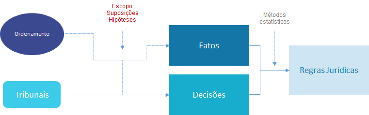
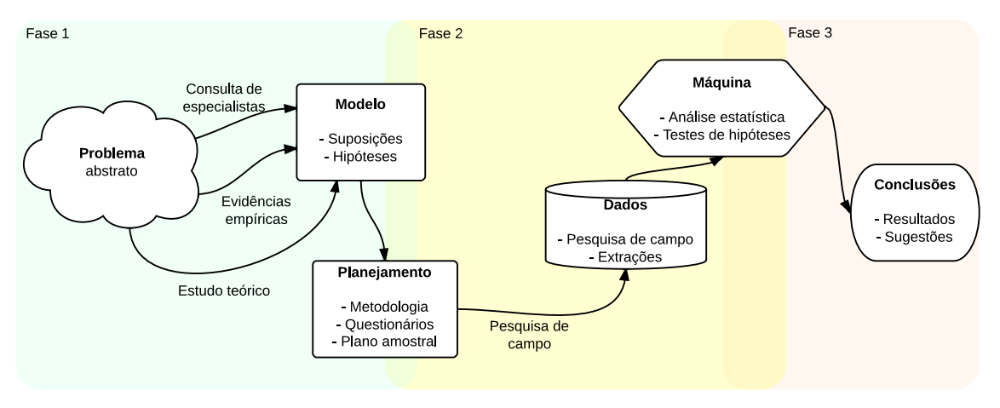
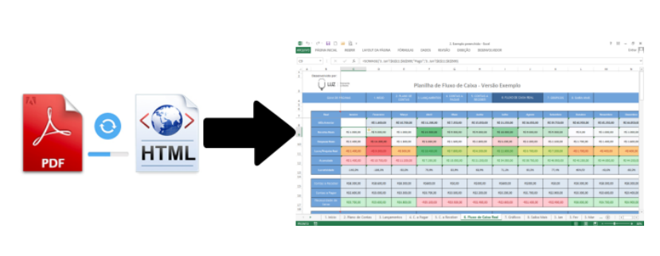
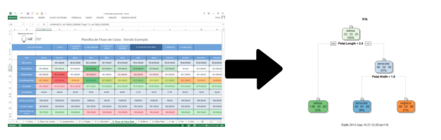

```{r setup, include=FALSE}
knitr::opts_chunk$set(
  echo = FALSE,
  message = FALSE,
  warning = FALSE,
  fig.align = "center"
)
```


## O que estamos fazendo aqui?

Neste semestre, tentaremos responder à pergunta: 

<center> <b>Como desenvolver um projeto de jurimetria?</b> </center>

--

Nossa jornada começa com as definições básicas de jurimetria e, através de diversos exemplos, discutiremos todos os aspectos metodológicos envolvidos.

--

No final, você será capaz de 

- pensar um problema cientificamente, 
- construir boas perguntas de pesquisa, 
- planejar um estudo jurimétrico e 
- desenhar o passo-a-passo para realizá-lo na prática. 

--

Se quiser, você poderá até realizar algumas análises e programas!

---

## VAMOS APRENDER IA??!?!!11

--

- Sim, mas provavelmente não da forma que você espera 😉 

--

- Tem muito *hype* em torno da Inteligência Artificial.

```{r}

```

--

- Vamos discutir o tema a partir de aplicações.

---

## As aulas

- As aulas acontecerão às sextas, das 10h15 às 11h55.

--

Uso do tempo de aula (aproximado)

```{r, echo=FALSE}
tab <- tibble::tribble(
  ~Horario, ~Atividade,
  "10h15 - 10h30", "Dúvidas e correção do quiz da aula anterior",
  "10h30 - 11h30", "Aula expositiva",
  "11h30 - 11h55", "Dúvidas e quiz"
)
knitr::kable(tab)
```

---
class: middle

## Dinâmica das aulas

- Pode me interromper para dúvidas e comentários. O plano de aula é apenas um guia, mas a aula vai para onde a gente quiser.

--

- Algumas dúvidas serão respondidas na hora. Outras serão respondidas mais tarde na própria aula ou em aulas futuras.

---
class: middle

## Materiais

- Os slides, quizzes etc serão disponibilizados na [página do curso](https://ndtj.github.io/202203-m-jurimetria).

- Outros materiais poderão ser disponibilizados no __Teams__.

- Perguntas podem ser enviadas pelo Teams ou no e-mail [jaztrecenti@pucsp.br](mailto:jaztrecenti@pucsp.br)

---

## Por onde vamos?

Jurimetria não é software, é processo. Vamos aprender como isso funciona e o que devemos levar em conta.

<center>

</center>   

---
class: center, middle, inverse

# Plano de aulas

```{r, echo=FALSE, message=FALSE, results='asis'}

googlesheets4::gs4_auth("julio.trecenti@gmail.com")
da <- googlesheets4::read_sheet("1aRaPjKO0h3F0S5pdXXT7rAnC66WVC52Mi08cHYlW3xY")

slide_aula <- function(x, y) {
  cat("\n---\n")
  cat(glue::glue("## {y}. {x$titulo}\n\n"))
  cat(glue::glue("__Data__: {format(as.Date(x$data), '%d/%m/%Y')}\n\n"))
  cat(glue::glue("\n\n__Tipo__: {x$tipo}\n\n"))
  cat(glue::glue("\n\n__Bimestre__: {x$bimestre}\n\n"))
  cat(glue::glue("\n\n__Atividades__:\n\n{x$tema}\n\n"))
  if (!is.na(x$obs)) cat(glue::glue("\n\n__Obs__: {x$obs}\n\n"))
}

da |> 
  dplyr::group_split(aula) |> 
  purrr::iwalk(slide_aula)

```

---

## Notas

Para cada bimestre:

- __Quiz do final da aula__: 50% 
    - Cada quiz vale 1,0 na nota do bimestre.
    - Cada quiz terá ~5 questões de múltipla escolha.
    - Poderemos ter questões extras, valendo __pontos extras__.
    - Os quizes podem ser feitos individualmente ou em grupo, mas a entrega é individual.
    - O prazo de cada quiz é de 1 semana: 23h59 da quinta-feira anterior à aula.
    
- __Prova__: 50%
    - Cada prova vale 5,0 na nota do bimestre
    - A prova poderá ter questões extras, valendo pontos extras. 
    - Dependendo do andar das aulas, poderemos substituir alguma prova por um trabalho em grupo.

---
class: middle

# Guia para os slides

#### Slides sobre cases: __<span style="color:#3B0F70;">marca azul</span>__

#### Slides sobre conceitos: __<span style="color:#DE4968;">marca rosa</span>__

#### Slides sobre metodologia: __<span style="color:#7AD151;">marca verde</span>__


---
class: center, middle, inverse

# 1. Aspectos gerais da pesquisa jurimétrica

---
class: stats

# O que é jurimetria?

- Jurimetria é a __estatística__ aplicada ao __direito__.

--

- Fazer jurimetria é pensar o direito de forma __concreta__, colocando nosso objeto de estudo no __tempo__ e no __espaço__.

--

<hr/>

.center[
## Exemplo
]

.pull-left[

### Estudo clássico

Princípios jurídicos e pensamento de especialistas sobre o valor de indenização por dano moral a ser concedido no contexto de direito do consumidor.

]

--

.pull-right[

### Estudo jurimétrico

Valores típicos de dano moral em sentenças de primeira instância de processos envolvendo direito do consumidor no Tribunal de Justiça de São Paulo em 2021.

]

--

- A jurimetria __complementa__ o estudo clássico do direito, considerando leis, __princípios__ jurídicos e pensamentos abstratos como __hipóteses__ que se manifestam ou não na __realidade__ através das __decisões__ judiciais.


---
class: stats

# Definição de hipóteses

```{r, out.width="100%"}

```

---
class: stats

# Ciclo da ciência de dados

Sabemos onde estão os dados. O que fazer?

```{r, out.width="90%"}
knitr::include_graphics("img/ciclo-ciencia-de-dados.png")
```

---
class: jurimetrics

# Nosso dia-a-dia

.pull-left[

#### Download

```{r, out.width="100%"}
knitr::include_graphics("img/download_esaj.png")
```

]

--

.pull-right[

#### Arrumação

```{r, out.width="100%"}

```

]

--

.center[

#### Visualização / Modelagem

]

```{r, out.width="50%"}

```


---
class: jurimetrics

## Resumo

__Conceitos__

- Pensar jurimetria é pensar de forma __concreta__
- A jurimetria é complementar ao estudo clássico do direito, e tem limites
- Para fazer jurimetria, precisamos de dados!

--

__Metodologia__

- Antes de realizar a coleta, precisamos definir nossas perguntas de pesquisa.
- Os parâmetros da coleta precisam ser bem especificados.
- Algumas perguntas podem surgir durante a análise dos dados.

--

__Próxima aula__: Estatística básica 🤓 

---
class: middle, center

# Apoio

.pull-left[

```{r, echo=FALSE, fig.align="center", out.width="80%"}
knitr::include_graphics("https://ndtj.com.br/img/logo.png")
```

[Núcleo de Direito, Tecnologia e Jurimetria /  PUC-SP](https://ndtj.com.br)

]

.pull-right[

```{r, echo=FALSE, fig.align="center", out.width="80%"}
knitr::include_graphics("https://abj.org.br/assets/logo-home.png")
```

[Associação Brasileira de Jurimetria](https://abj.org.br)

]


